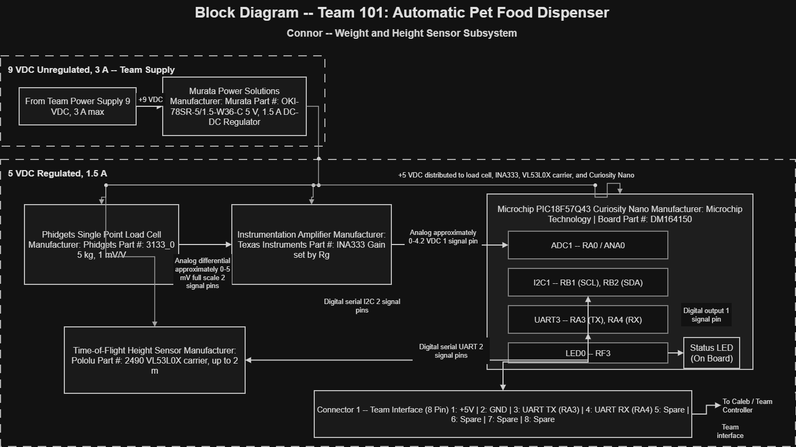

# Block Diagram

## Connor: Weight and Height Sensor Subsystem

The following block diagram shows the electrical architecture of my subsystem for Team 101's Automatic Pet Food Dispenser.

My subsystem is responsible for measuring pet food weight and height. The system uses a load cell with an instrumentation amplifier for weight measurement and a time-of-flight sensor for height measurement. Both sensor systems interface with the Microchip PIC18F57Q43 Curiosity Nano.

The diagram also identifies the major components, manufacturer part numbers, microcontroller peripherals, signal types, signal directions, power requirements, and the connection to the team interface.

